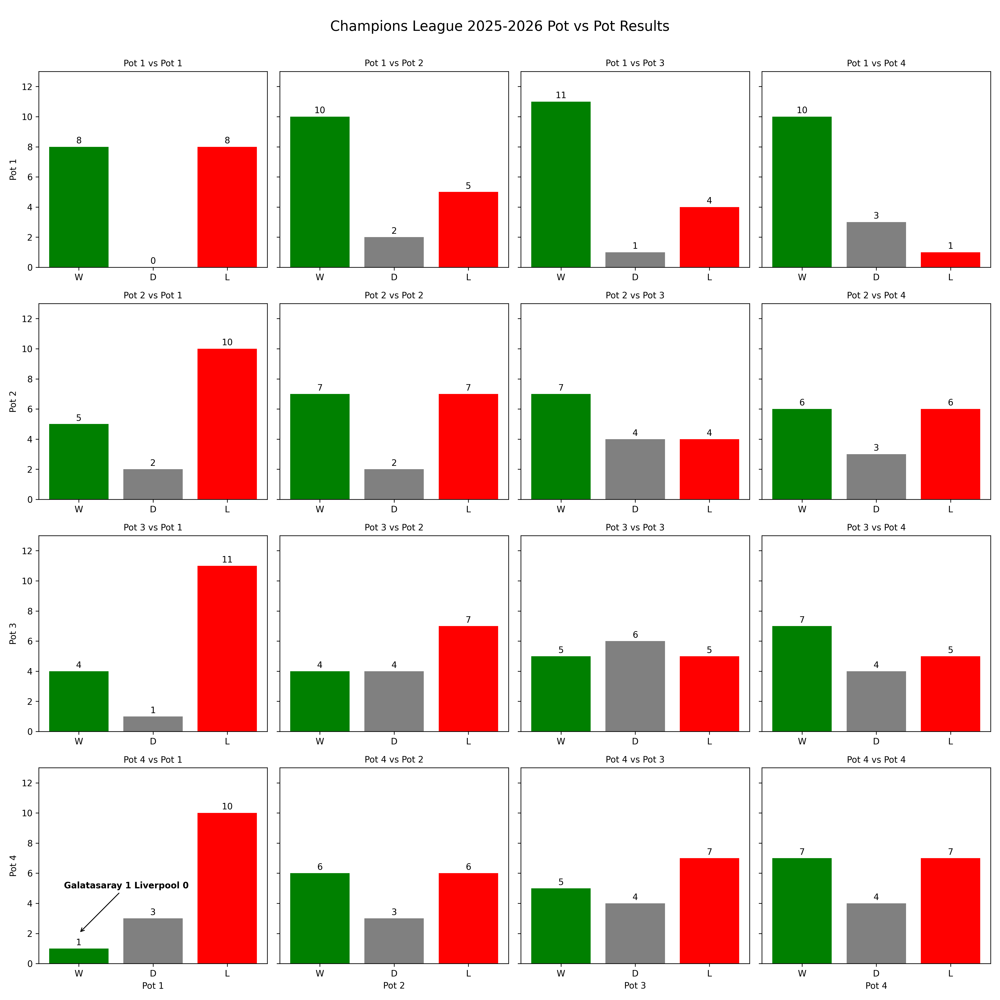

# Analysis of Champions League Pot vs Pot Results

This project analyzes the UEFA Champions League 2025-2026 season, focusing on the results between teams from different seeding pots (Pot 1 to Pot 4).

## Overview
- Data is scraped from Wikipedia and processed using Python.
- The analysis visualizes the outcomes (win, draw, loss) for each pot vs every other pot.

## Key Insight
**Before the last matchday, Galatasaray is the only team from Pot 4 to have beaten a Pot 1 team.**

## Visualization
Below is the results matrix for Pot vs Pot matchups in the 2025-2026 season:

The highlighted annotation in the image marks Galatasaray's win over Liverpool.
