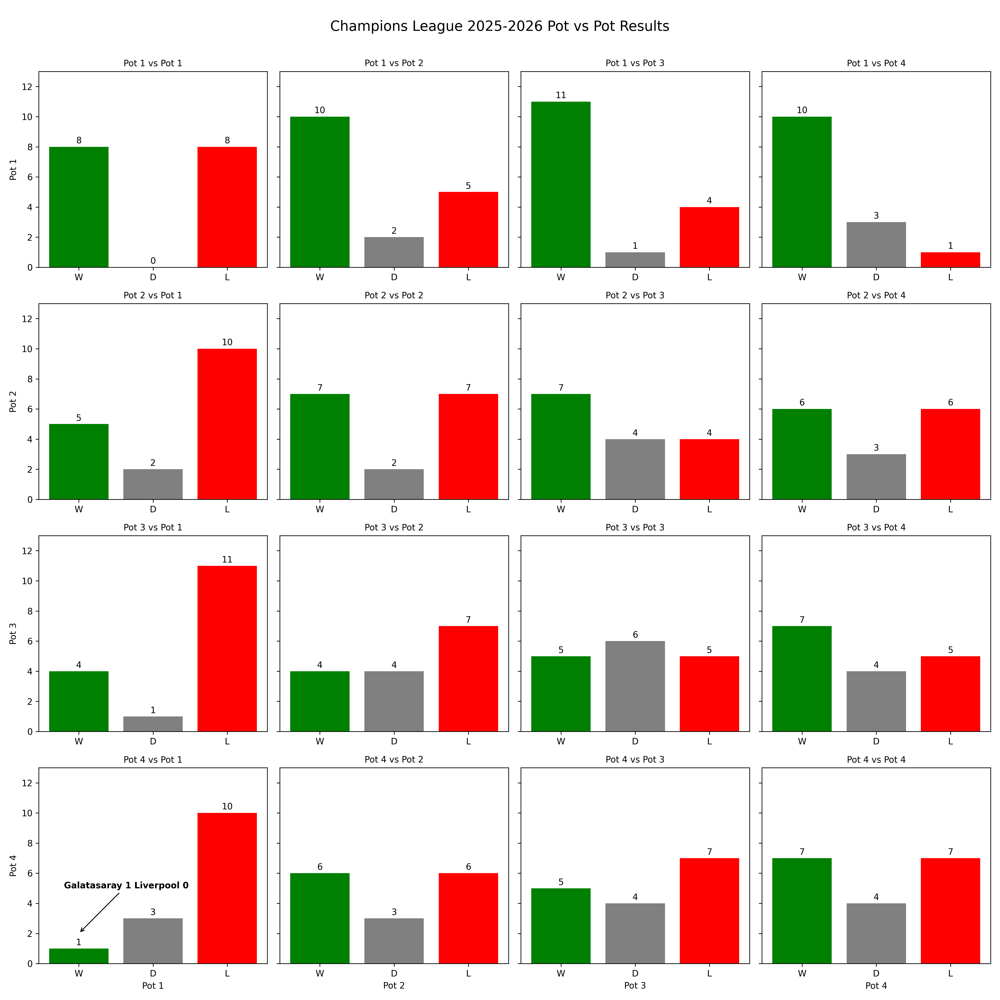

# Analysis of Champions League Pot vs Pot Results

This project analyzes the UEFA Champions League 2025-2026 season, focusing on the results between teams from different seeding pots (Pot 1 to Pot 4).

## Overview
- Data is scraped from Wikipedia and processed using Python.
- The analysis visualizes the outcomes (win, draw, loss) for each pot vs every other pot.

## Key Insight
**Before the last matchday, Galatasaray is the only team from Pot 4 to have beaten a Pot 1 team.**

## Visualization
Below is the results matrix for Pot vs Pot matchups in the 2025-2026 season:

The highlighted annotation in the image marks Galatasaray's win over Liverpool.

---

## NEW: Round of 16 Analysis (2000–2026)

### Data Extraction
- The script `round_16.py` scrapes and compiles all teams reaching the Champions League Round of 16 from 2000–01 to 2025–26.
- Results are saved in `teams_in_round_16.csv` with columns: season, country, team.

### Visualization
- The R script `champions_league_round_16_ggplot.R` visualizes the geographic distribution of Round of 16 teams per season.
- Output maps are saved in the `season_maps/` folder.
- A summary video is available: `champions_league_round_16.mp4`.

### Example Data
- Sample from `teams_in_round_16.csv`:

| season   | country         | team              |
|----------|-----------------|-------------------|
| 2000–01  | Spain           | Real Madrid[TH]   |
| 2000–01  | Germany         | Bayern Munich     |
| ...      | ...             | ...               |

### Insights
- The dataset enables longitudinal analysis of national representation and club performance in the Champions League knockout phase.

---

## File Overview
- `pot_vs_pot_results.py` and `pot_vs_pot_results_2024.py`: Pot vs Pot matchup analysis and visualization.
- `round_16.py`: Scrapes and compiles Round of 16 teams for all seasons.
- `teams_in_round_16.csv`: Cleaned dataset of Round of 16 teams.
- `champions_league_round_16_ggplot.R`: R script for mapping teams by country and season.
- `champions_league_round_16.mp4`: Animated summary of Round of 16 teams.

---

For questions or contributions, please open an issue or pull request.
